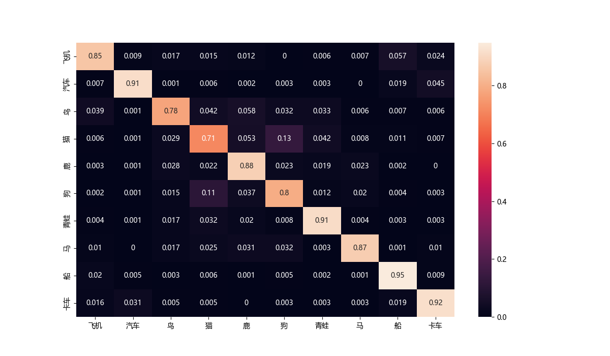
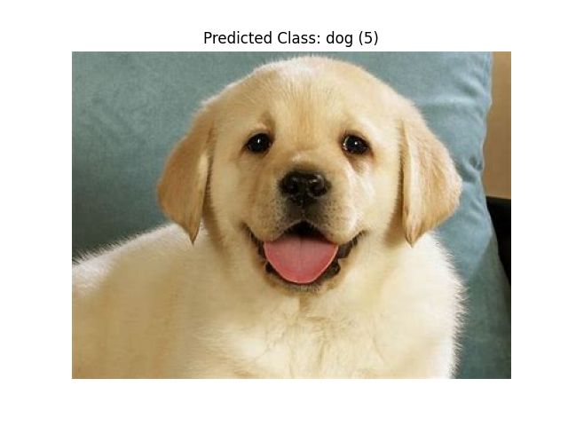
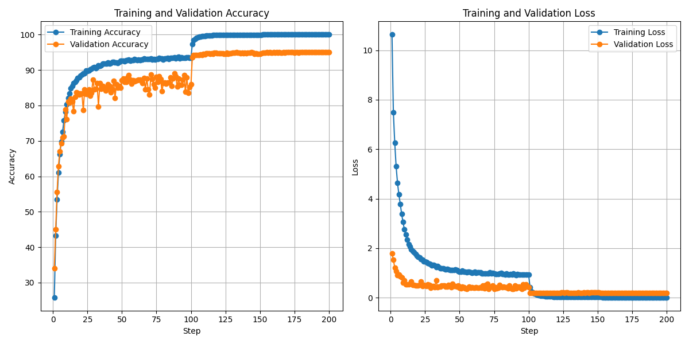

# LearnDeepWithPyTorch

学习深度学习，主要是PyTorch

----

学习通作业  
[workForStu](./code/DR006.ipynb)

1. 手写数字识别(前馈神经网络)
2. MINST(深度学习网络)
3. RNN影评情感分析(IMDb数据集)

----

### 课设

基于CIFAR-10图像分类数据集的图像分类 : [CODE](./课设)

---

### MNIST数据集

    共有训练数据60000项、测试数据10000项。
    每张图像的大小为28*28（像素），每张图像都为灰度图像，位深度为8（灰度图像是0-255）。  

由Yann LeCun搜集，是一个大型的手写体数字数据库，通常用于训练各种图像处理系统，也被广泛用于机器学习领域的训练和测试。

'''

1. train-images.idx3-ubyte.gz：训练集图片（9912422字节），55000张训练集，5000张验证集
2. train-labels.idx1-ubyte.gz：训练集图片对应的标签（28881字节），
3. t10k-images.idx3-ubyte .gz：测试集图片（1648877字节），10000张图片
4. t10k-labels.idx1-ubyte.gz：测试集图片对应的标签（4542字节）
   '''

-----

### 影评情感分析

由于情感可以被分类为离散的极性或尺度（例如，积极的和消极的），我们可以将情感分析看作⼀项⽂本分类任务，它将可变⻓度的⽂本序列转换为固定⻓度的⽂本类别   
`IMDb数据集:`  [下载地址](https://ai.stanford.edu/~amaas/data/sentiment/)  
电影评论,标签为消极或者积极。

### 课设

cifar-10 数据进行图片分类  
ResNet18和50、自定义的CNN网络结构  
采取tensorboard 进行训练可视化等操作  
MyResnet以及聚类的方法的探索使用

1. [项目所在文件夹](./课设)
2. [IPYNB文件](./课设/6/IPYNB)
3. [mean聚类](./课设/6/mean)
4. [训练预测可视化图片](./课设/6/plot_pic)

  
    
  